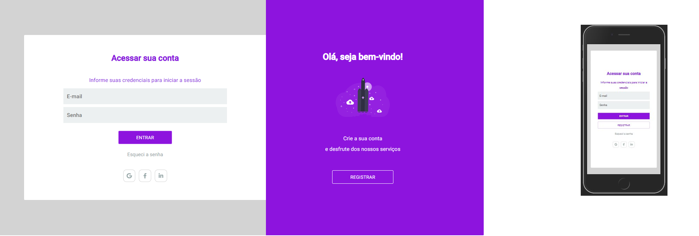

## Project of authentication

### Typical use case

```
sign-in-sign-up
└── packages
    ├── web
    │   ├── src
    │   └── package.json
    ├── server
    │   ├── src
    │   └── package.json
    └── package.json
```




## 🚀 Technologies

Technologies that I used to develop this application

- [Node.js](https://nodejs.org/en/)
- [ReactJS](https://reactjs.org/)
- [TypeScript](https://www.typescriptlang.org/)
- [Express](https://expressjs.com/pt-br/)
- [TypeORM](https://typeorm.io/#/)
- [SQLite](https://www.sqlite.org/)
- [React Router DOM](https://reacttraining.com/react-router/)
- [JSON Web Tokens](https://jwt.io/)

### Requirements

- [Node.js](https://nodejs.org/en/)
- [Yarn](https://classic.yarnpkg.com/)


## 💻 Getting started

Import the `Auth.postman_collection.json` on Insomnia App or click on [Run in postman](#postimanButton) button

**Clone the project and access the folder**

 $ git clone git@github.com:Joandysson/sign-in-sipn-up.git

```
# Install

$ yarn

# Run migrations

$ yarn server typeorm  migration:run

# Run server

$ yarn server dev

# Run web

$ yarn web start

```


> by Joandysson Gama [See my linkedin](https://www.linkedin.com/in/joandysson-gama-63360150/)